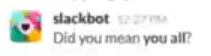

# Read me!

This is a parody of the extreme, far-left leaning contributor covenant - along with some [banned terms from a US gov project, pre-DEI ban.](https://github.com/18F/charlie/blob/94382d69cdd76714fe486760c22ad1c2144a49a6/InclusionBot.md) As woke and left leaning as I am, I do not like things like DEI and banning enginering terms such as "master", "slave", "blacklist", and "whitelist." I also do not like the idea of banning things such as "_hugs_" or even things are ridiculous as "fuck" or "shit." If you're in a professional setting you're likely not to use those terms anyways. I also dislike, as LGBTIAQ+ supporting as I am, and being a bisexual/homoromantic, femboy loving person myself, workplaces or FOSS projects having LGBTIAQ+ only jobs.

That being said, I am disgusted by one thing Lunduke does, but it's honestly OK to disagree with each other on these things because politics in the real world are weird like that (I think, I don't go out much) - I hate it when he says "a man who thinks he's a woman" when refering to a trans woman or "a woman who think she's a man" when he is refering to a trans man. They, in my opinion, should be respected by their pronouns and sexual identities they are identifed as. For instance: I identify as per/pers AND he/him, but people go by different pronouns as they see fit and should be respected as such. Think of it kind of like autism: just like autism, genders, along with sexuality, are a spectrum.

Eh but who really cares what other people think. It only matters what YOU think and believe in. That's why I made this parody CoC - to get some of that mind-numbing horible wokeness of InclusionBot.md from the US gov DEI chatbot project (linked above) and things such as the Contributor Covenant and other woke shit off my brain. I think it's still numbing my brain a bit but oh well.

Enjoy your day, guys!

